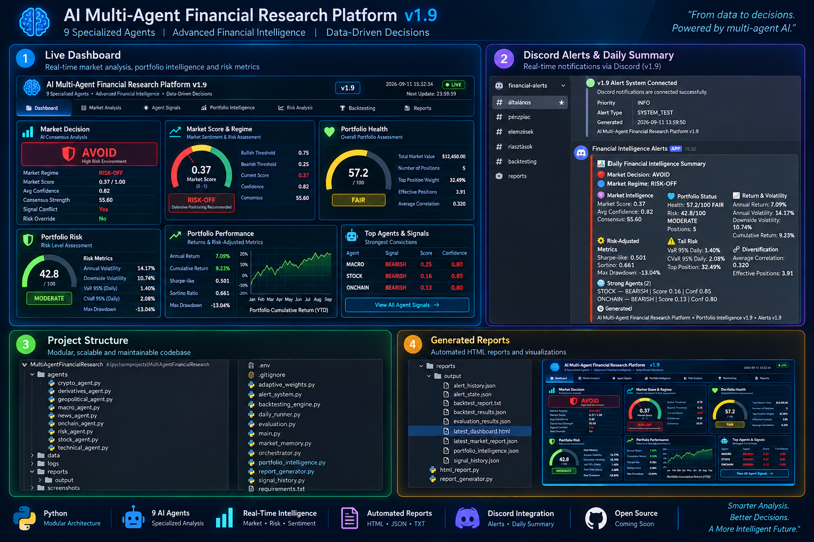

# AI Multi-Agent Financial Research Platform v1.9

Advanced Python-based multi-agent financial intelligence and portfolio analytics platform.

## Overview

AI Multi-Agent Financial Research Platform v1.9 is an advanced Python-based financial intelligence and decision-support system built around specialized analytical agents and a central orchestration layer.

The platform combines:

- Macroeconomic analysis
- Stock market analysis
- Cryptocurrency analysis
- On-chain intelligence
- Derivatives data
- Technical analysis
- Financial news
- Geopolitical analysis
- Portfolio analytics
- Risk management

Each agent independently evaluates its domain and produces structured signals, scores, confidence levels and supporting metrics.

The central orchestrator aggregates these outputs into:

- Overall market decision
- Market regime
- Market score
- Consensus strength
- Risk assessment

## Core Features

- Multi-agent financial analysis
- Central orchestration engine
- Market Memory
- Signal History
- Adaptive Agent Weighting
- Historical Backtesting
- Portfolio Intelligence
- Allocation analysis
- Concentration and exposure analysis
- Correlation analysis
- Annualized return and volatility
- Downside volatility
- Maximum drawdown
- Sharpe-like and Sortino ratios
- Historical VaR / CVaR
- Diversification metrics
- Rebalancing recommendations

## v1.9 Features

Version v1.9 introduces an automated Alert & Notification System with Discord integration.

The system includes:

- INFO alerts
- WARNING alerts
- CRITICAL alerts
- Duplicate alert protection
- Daily Financial Intelligence Summary
- Market regime monitoring
- Portfolio health monitoring
- Risk metric monitoring
- Strongest agent signal reporting

## Architecture

The system follows a modular multi-agent architecture where specialized analytical agents operate independently and send structured outputs to a central orchestrator.

The orchestrator combines agent signals into a unified financial intelligence layer.

## Technologies

- Python
- Multi-Agent Systems
- Agentic AI
- Financial Analytics
- yfinance
- NumPy
- Requests
- Market APIs
- Discord Webhooks
- HTML Reporting

## Project Goal

The goal of this project is to build an end-to-end AI-powered financial intelligence platform capable of combining macroeconomic, market, crypto, on-chain, geopolitical and portfolio data into structured decision-support signals.

## Version

Current version:

**v1.9**
## Platform Dashboard

## Platform Dashboard

